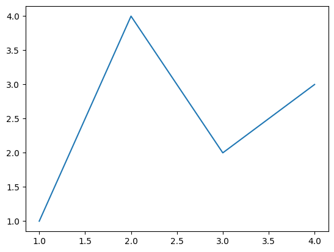
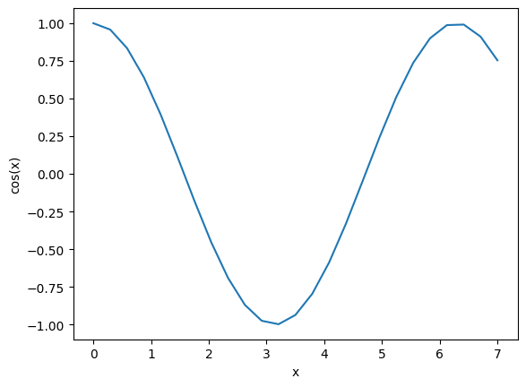
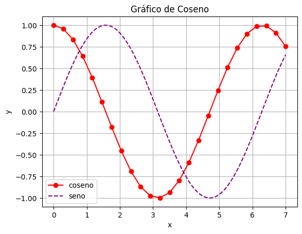
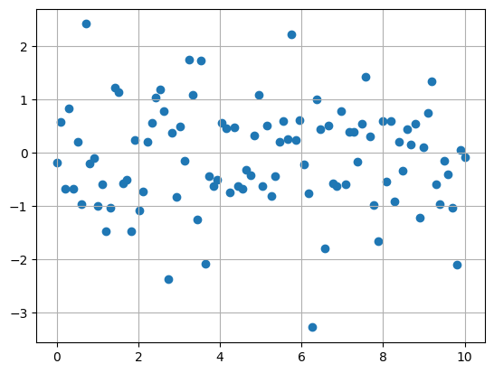
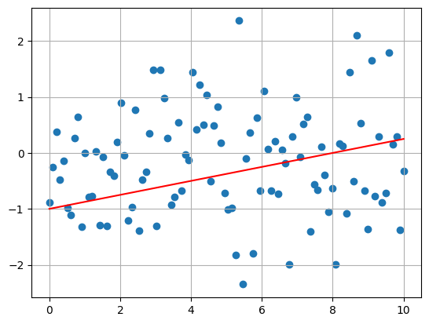
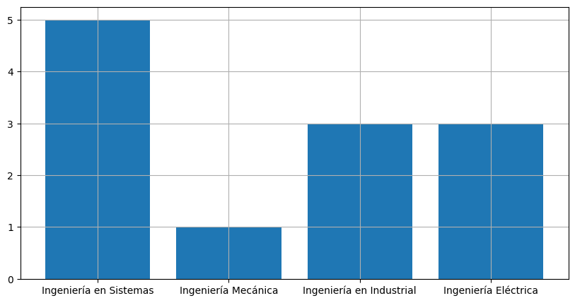
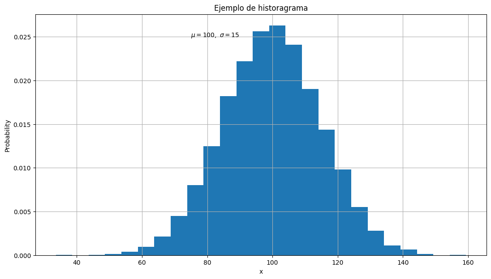
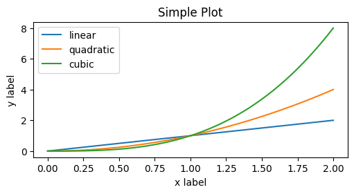
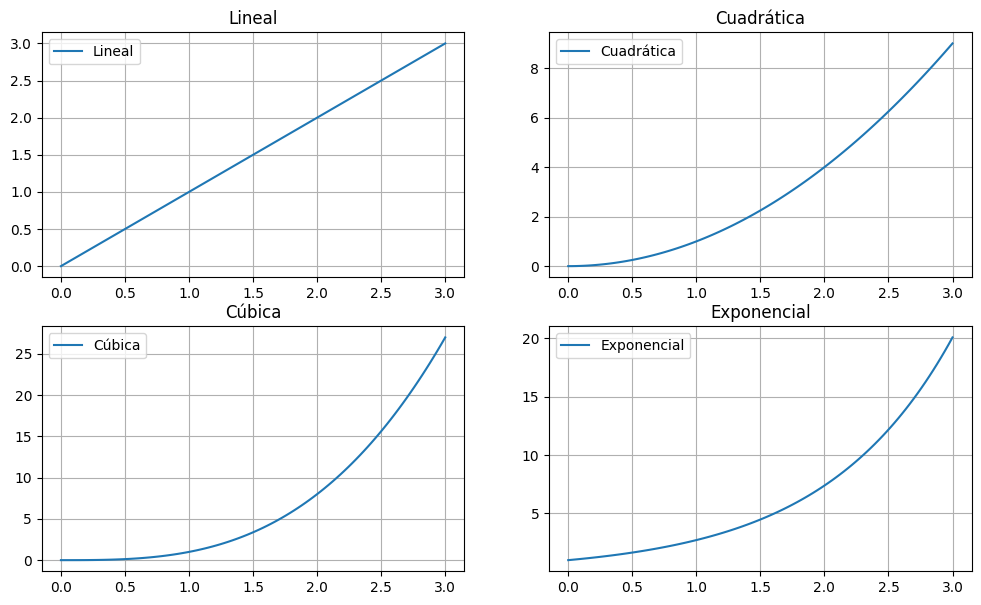
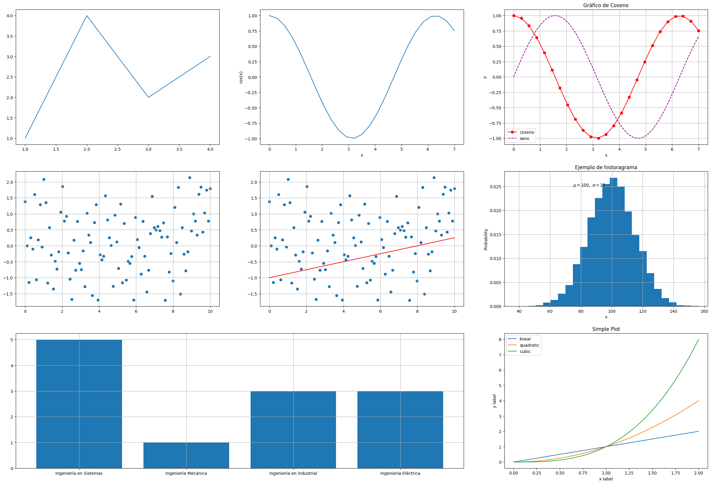

# Matplotlib

Matplotlib es una librería para la creación de visualizaciones. Bastante útil para realizar gráficas de datos.

Primero que nada, debemos instalarla, en caso que no la tengamos ya. Como siempre, podemos hacerlo con `conda` o con `pip`:
```shell
# pip
pip install matplotlib

# conda
conda install matplotlib
```

Y para importarlo, colocamos:
```python
import matplotlib.pyplot as plt
```

Puede encontrar mucha más información desde el [sitio oficial](https://matplotlib.org/stable/users/explain/quick_start.html).

# Gráficas

Matplotlib utiliza `Figure`s para mostrar las gráficas, las cuales tienen ejes y un espacio para mostrar la gráfica. Un ejemplo sencillo es el siguiente:
```python
fig, ax = plt.subplots()             # crea una figura con un plano (o eje)
ax.plot([1, 2, 3, 4], [1, 4, 2, 3])  # plotea los datos en el plano
plt.show()                           # muestra la figura
```



> Nota: desde JupyterNotebooks no es obligatorio usar el `.show()`.

# Partes

La documentación oficial de Matplotlib cuenta con una imagen perfecta para entender las partes de una `Figure`:


Vamos a analizarla por partes:

## `Figure`

Es la figura completa, que tiene a los ejes (`axes`) como hijos. La figura puede ser de varias formas:
```python
fig = plt.figure()             # figura vacía
fig, ax = plt.subplots()       # figura con un axes
fig, axs = plt.subplots(2, 2)  # figura con 4 axes en forma de matriz 2x2

# igual que la anterior, pero cada axes tiene su propio nombre
fig, axs = plt.subplot_mosaic([['left', 'right_top'],
                               ['left', 'right_bottom']])
```

## `Axes`

Son el conjunto de ejes (`axis`) y demás elementos necesarios para graficar (como el título, etc.). Suelen tener 2 `axis`. Y podemos configurar sus elementos como el título (`ax.set_title`), las etiquetas de los ejes (`ax.set_xlabel`), la leyenda (`ax.legend`), etc.

## `Axis`
Son los ejes, como por ejemplo el eje $x$ y el eje $y$ (o los que tengamos) en nuestras gráficas.

# Graficar

Podemos graficar utilizando arrays de NumPy, de las siguientes maneras:
```python
# forma exponencial
X1 = np.linspace(0, 3, 100)
Y1 = np.exp(X1)

# forma de seno
X2 = np.linspace(0, 7, 100)
Y2 = np.sin(X2)

# forma de coseno
X3 = np.linspace(0, 7, 25)
Y3 = np.cos(X3)
```

Podemos graficar varias en un mismo `Axes`, además de poderlas agrupar en un diccionario:
```python
datos = {
    'coseno'    : Y3,
    'x'         : X3
}

fig, ax = plt.subplots(figsize=(5, 2.7), layout='constrained')
ax.plot('x', 'coseno', data=datos)
ax.set_xlabel('x')
ax.set_ylabel('cos(x)')
fig.show()
```
Y de igual forma, podemos hacer esto mismo con un DataFrame de Pandas:
```python
df = pd.DataFrame(datos)

fig, ax = plt.subplots()
ax.plot('x', 'coseno', data=df)
ax.set_xlabel('x')
ax.set_ylabel('cos(x)')
plt.show()
```

En ambos casos obtendremos la siguiente gráfica:



Y podemos añadirle ciertas cosas estéticas para mejorarla. Por ejemplo, título, leyenda, etc.
```python
fig, ax = plt.subplots() 
ax.plot('x', 'coseno', '-o' ,data=df, color='red')
# '-o' es para el estilo de la línea
# data=df es para usar el dataframe como fuente
# color='red' configura el color

ax.plot(X2, Y2, '--', color='purple', label='seno')
# usamos directamente los arreglos X2 y Y2
# es importante que ambos sean del mismo tamaño
# el estilo de línea será '--'
# color morado
# y la etiqueta de esta gráfica es 'seno'

# las etiquetas de los axis
ax.set_xlabel('x')
ax.set_ylabel('y')

# cuadriculamos el fondo
ax.grid()

# agregamos un título
ax.set_title('Gráfico de Coseno')

# colocamos una leyenda
ax.legend()

# mostramos
plt.show()
```
Esto nos queda:



Hasta ahora, hemos visto como graficar usando `.plot()`, pero tambien existen otras formas. Por ejemplo, podemos usar `.scatter()`, el cual coloca una figura (como un punto) en la posición (sin trazar una línea que los una).

```python
Y = np.random.normal(0, 1, 100)
X = np.linspace(0, 10, 100)

fig, ax = plt.subplots()
ax.scatter(X, Y)
ax.grid()
```


Como podemos ver, al haber usado una distribución normal para los datos estos se agrupan en línea recta al rededor de la media (que en este caso es $0$).

Y de igual manera, podemos combinar los tipos de gráficas en caso que lo necesitemos, por ejemplo:

```python
Y = np.random.normal(0, 1, 100)
X = np.linspace(0, 10, 100)

fig, ax = plt.subplots()
ax.scatter(X, Y)
ax.plot(X, 1/8 * X - 1, color='red')
ax.grid()
```



Además, contamos con la posibilidad de crear otros tipos de gráficas más específicas, como lo son las gráficas de barras o los historiagramas:
```python
fig, ax = plt.subplots(figsize=(10,5))
categories = ['Ingeniería en Sistemas', 'Ingeniería Mecánica', 'Ingeniería en Industrial', 'Ingeniería Eléctrica']
valores = [5, 1, 3, 3]
ax.bar(categories, valores)
ax.grid()
```


Y de igual forma tenemos los historagramas:
```python
mu, sigma = 100, 15
x = np.random.normal(mu, sigma, 10000)
fig, ax = plt.subplots(figsize=(13, 7))

# historagrama
n, bins, patches = ax.hist(x, 25, density=True)

ax.set_xlabel('x')
ax.set_ylabel('Probability')
ax.set_title('Ejemplo de historagrama')
# con esto podemos agregar texto
ax.text(75, .025, r'$\mu=100,\ \sigma=15$')
ax.grid()
```


# Interfaces

Esencialmente, existen dos formas de hacer gráficas en Matplotlib:
1. Creando explícitamente las `Figure` y los `Axes`, y usando sus métodos (OO-Style).
2. Implícitamente crear y manejar las `Figure` y los `Axes` desde las funciones de pyplot.

No existe una diferencia entre ambos más allá de la comodidad de usar uno u otro. Aquí un ejemplo:

OO-style
```python
x = np.linspace(0, 2, 100)  # datos

# Creamos la figura
fig, ax = plt.subplots(figsize=(5, 2.7), layout='constrained')
ax.plot(x, x, label='linear')  # graficamos un poco de datos
ax.plot(x, x**2, label='quadratic') 
ax.plot(x, x**3, label='cubic') 
ax.set_xlabel('x label')  # añadimos etiquetas
ax.set_ylabel('y label')  
ax.set_title("Simple Plot")  # añadimos título
ax.legend()  # añadimos la leyenda
```
pyplot-style
```python
x = np.linspace(0, 2, 100)  # datos

plt.figure(figsize=(5, 2.7), layout='constrained')
plt.plot(x, x, label='linear')  # graficamos un poco de datos
plt.plot(x, x**2, label='quadratic')  
plt.plot(x, x**3, label='cubic')
plt.xlabel('x label') # añadimos etiquetas
plt.ylabel('y label')
plt.title("Simple Plot") # añadimos título
plt.legend()# añadimos la leyenda
```
Ambos generarán la misma gráfica:



# Multiples gráficas

Como habíamos mencionado anteriormente, Matplotlib nos brinda la capacidad de poder realizar multiples gráficas a la vez, esto por medio tanto de `plt.subplots()` como de `plt.subplot_mosaic()`.

Por ejemplo, supongamos que deseamos realizar la gráfica de algunas funciones, como la lineal, cuadrática, cúbica, exponencial, etc. Pero no queremos que se quede todo en una misma gráfica, podemos realizarlo de la siguiente manera.

```python
x = np.linspace(0, 3, 100)

fig, axs = plt.subplots(2, 2, figsize=(12, 7))   # esto creará una matriz de 2x2 axes en axs

# hacemos la primera
axs[0, 0].plot(x, x, label='lineal')
axs[0, 0].set_title('Lineal')
axs[0, 0].grid()
axs[0, 0].legend()

# la segunda
axs[0, 1].plot(x, x**2, label='cuadratica')
axs[0, 1].set_title('Cuadrática')
axs[0, 1].grid()
axs[0, 1].legend()

# tercera
axs[1, 0].plot(x, x**3, label='cubica')
axs[1, 0].set_title('Cúbica')
axs[1, 0].grid()
axs[1, 0].legend()

# y cuarta
axs[1, 1].plot(x, np.exp(x), label='exponencial')
axs[1, 1].set_title('Exponencial')
axs[1, 1].grid()
axs[1, 1].legend()
```

De igual manera, podemos hacerlo por medio de `plt.subplot_mosaic()`, con la diferencia que este es más sencillo de automatizar:
```python
x = np.linspace(0, 3, 100)

funs = [
    lambda x: x,
    lambda x: x**2,
    lambda x: x**3,
    lambda x: np.exp(x)
]

names = [
    'Lineal',
    'Cuadrática',
    'Cúbica',
    'Exponencial'
]

fig, axs = plt.subplot_mosaic([['grafica1', 'grafica2'],
                                ['grafica3', 'grafica4']], figsize=(12, 7))

for i in range(1, 5):
    axs[f'grafica{i}'].plot(x, funs[i - 1](x), label=names[i - 1])
    axs[f'grafica{i}'].set_title(names[i - 1])
    axs[f'grafica{i}'].grid()
    axs[f'grafica{i}'].legend()
```

Y con ambas obtendremos:


Por último, una demostración de cómo podemos condensar todo lo que hemos visto dentro de una sola gráfica:

```python
# datos

X3 = np.linspace(0, 7, 25)
Y3 = np.cos(X3)

X2 = np.linspace(0, 7, 100)
Y2 = np.sin(X2)

Y = np.random.normal(0, 1, 100)
X = np.linspace(0, 10, 100)

categories = ['Ingeniería en Sistemas', 'Ingeniería Mecánica', 'Ingeniería en Industrial', 'Ingeniería Eléctrica']
valores = [5, 1, 3, 3]

mu, sigma = 100, 15
x2 = np.random.normal(mu, sigma, 10000)

x = np.linspace(0, 2, 100)

datos = {
    'coseno'    : Y3,
    'x'         : X3
}

# gráficas

mosaico = [
    ['g1', 'g2', 'g3'],
    ['g4', 'g5', 'g6'],
    ['g7', 'g7', 'g9']
]
fig, axs = plt.subplot_mosaic(mosaico, figsize=(30, 20))

# primer gráfica
axs['g1'].plot([1, 2, 3, 4], [1, 4, 2, 3]) 

# mostrando cómo graficar
axs['g2'].plot('x', 'coseno', data=datos)
axs['g2'].set_xlabel('x')
axs['g2'].set_ylabel('cos(x)')

# ejemplo más pulido
axs['g3'].plot('x', 'coseno', '-o' ,data=df, color='red')
axs['g3'].plot(X2, Y2, '--', color='purple', label='seno')
axs['g3'].set_xlabel('x')
axs['g3'].set_ylabel('y')
axs['g3'].grid()
axs['g3'].set_title('Gráfico de Coseno')
axs['g3'].legend()

# scatter
axs['g4'].scatter(X, Y)
axs['g4'].grid()

# combinación de plot y scatter
axs['g5'].scatter(X, Y)
axs['g5'].plot(X, 1/8 * X - 1, color='red')
axs['g5'].grid()

# gráfico de barras
axs['g7'].bar(categories, valores)
axs['g7'].grid()

# historagrama
n, bins, patches = axs['g6'].hist(x2, 25, density=True)
axs['g6'].set_xlabel('x')
axs['g6'].set_ylabel('Probability')
axs['g6'].set_title('Ejemplo de historagrama')
axs['g6'].text(75, .025, r'$\mu=100,\ \sigma=15$')
axs['g6'].grid()

# lineales
axs['g9'].plot(x, x, label='linear') 
axs['g9'].plot(x, x**2, label='quadratic') 
axs['g9'].plot(x, x**3, label='cubic') 
axs['g9'].set_xlabel('x label')
axs['g9'].set_ylabel('y label')  
axs['g9'].set_title("Simple Plot")
axs['g9'].legend()
```

Resultado:

